# Multi-Tenant Module - Architecture

## 2. Architecture & Trust Boundaries

### Component Diagram

```mermaid
flowchart TB
    subgraph External["🌐 External Zone"]
        Browser["Browser/Client"]
    end

    subgraph HostZone["🏢 Host Application (Zoho/Entra/Okta)"]
        HostAuth["Host Auth UI<br/>(Login/MFA)"]
        HostRBAC["Host RBAC API<br/>/rbac/effective"]
        HostEmail["Host Email Gateway<br/>/email/send"]
        HostWebhook["Host Webhook Sender"]
    end

    subgraph ModuleZone["🔒 Module Zone (Our Control)"]
        APIM["Azure Functions<br/>HTTP Triggers"]
        Middleware["Middleware Pipeline<br/>JWT→Tenant→RBAC→Authz"]
        BizLogic["Business Logic"]

        subgraph Data["Persistence"]
            PG[(PostgreSQL<br/>tenant_id scoped)]
            AuditLog[(audit_events<br/>hash-chained)]
        end

        subgraph CacheLayer["Caching Layer"]
            Redis[("Redis/In-Memory<br/>RBAC Cache")]
        end

        subgraph Secrets["Secrets Management"]
            KeyVault["Azure Key Vault<br/>JWKS URI, API keys"]
        end
    end

    Browser -->|"1. Request + Host JWT"| APIM
    APIM -->|"2. Validate JWT"| Middleware
    Middleware -->|"3. Fetch JWKS"| KeyVault
    Middleware -->|"4. Get RBAC (cache miss)"| HostRBAC
    Middleware -->|"4a. Cache hit"| Redis
    HostRBAC -->|"5. Permissions + TTL"| Redis
    Middleware -->|"6. Authorize"| BizLogic
    BizLogic -->|"7. Tenant-scoped query"| PG
    BizLogic -->|"8. Audit event"| AuditLog
    BizLogic -->|"9. Send email request"| HostEmail
    HostWebhook -->|"10. RBAC purge webhook"| APIM
    APIM -->|"11. Invalidate cache"| Redis

    style HostZone fill:#fff4e6
    style ModuleZone fill:#e6f3ff
    style External fill:#f0f0f0
```

### Trust Boundaries

#### Boundary 1: External → Module
- **Control**: JWT validation (signature, iss, aud, exp)
- **Threat**: Token forgery, replay attacks
- **Mitigation**: JWKS signature verification, `jti` deduplication (optional), rate limiting

#### Boundary 2: Module → Host RBAC API
- **Control**: Mutual TLS (recommended) or API key authentication
- **Threat**: MITM, host impersonation
- **Mitigation**: Certificate pinning, secret rotation in Key Vault

#### Boundary 3: Module → Host Email Gateway
- **Control**: API key + idempotency key
- **Threat**: Email abuse, credential leakage
- **Mitigation**: Module never stores SMTP credentials; host handles all email provider logic

#### Boundary 4: Host → Module Webhooks
- **Control**: HMAC signature verification (SHA-256)
- **Threat**: Webhook spoofing, replay
- **Mitigation**: Verify `X-Webhook-Signature` header; optional timestamp validation

#### Boundary 5: Module → Database
- **Control**: Parameterized queries, tenant_id enforcement
- **Threat**: SQL injection, tenant data leakage
- **Mitigation**: ORM with tenant scoping, row-level security (RLS) policies

### Component Responsibilities

| Component | Responsibilities | Trust Level |
|-----------|-----------------|-------------|
| **Host App** | Authentication UI, RBAC decisions, email delivery | Authority |
| **Host RBAC API** | Return effective permissions for (tenant_id, user_id) | Trusted |
| **Azure Functions** | Business logic, tenant isolation, audit logging | Self |
| **PostgreSQL** | Tenant-scoped data persistence | Trusted (self-managed) |
| **Redis Cache** | Temporary RBAC storage (60-300s TTL) | Ephemeral |
| **Key Vault** | Secrets (JWKS URI, API keys, webhook secret) | Trusted (Azure) |
| **Frontend** | UI rendering | Untrusted (never trust tenant_id from client) |

### Data Flow Security

1. **Request arrives** → APIM receives `Authorization: Bearer <JWT>`
2. **JWT validation** → Verify signature via JWKS, check iss/aud/exp
3. **Tenant extraction** → Parse `tenant_id` from validated token claims (ONLY source of truth)
4. **RBAC fetch** → Check Redis cache for `rbac:{tenant_id}:{user_id}`, if miss → call host API
5. **Permission check** → Filter host permissions against module's allowlist, enforce via middleware
6. **DB query** → All queries include `WHERE tenant_id = $1` (parameterized)
7. **Audit append** → Write to `audit_events` with hash chain: `curr_hash = SHA256(prev_hash + event_json)`
8. **Email request** → POST to host gateway with `{tenant_id, template, vars, idempotency_key}`

